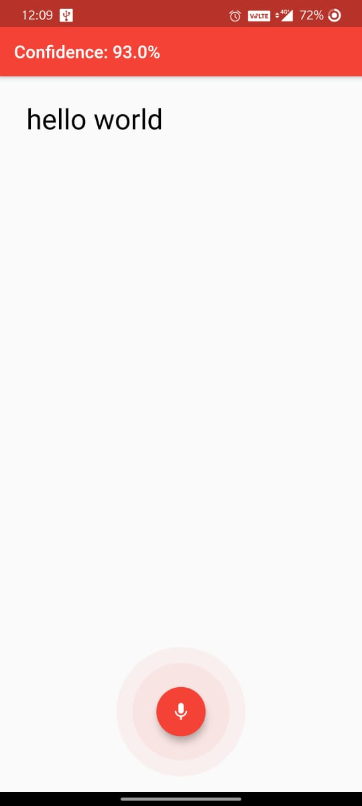

# Flutter_Listner

This is a simple flutter project for recognising voice and convert it to text. You can also heilight certain words if spoken. Also it showes the confidence level of the recognied words.

# Dependencies Used :

# APP Preview :
 
 

